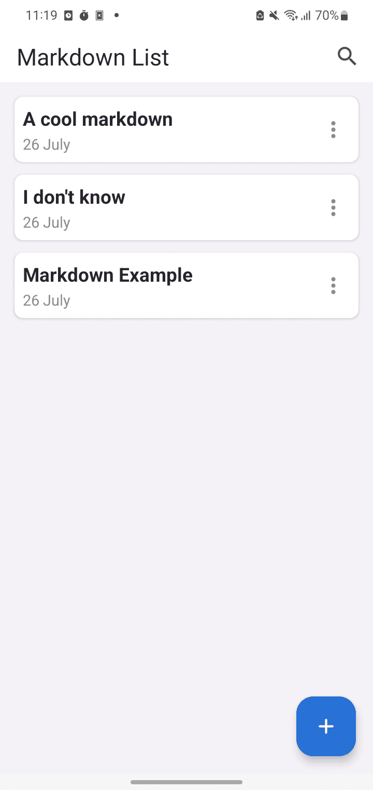
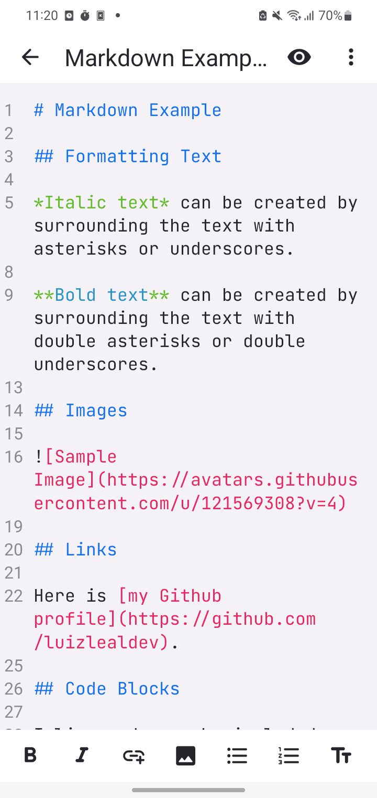
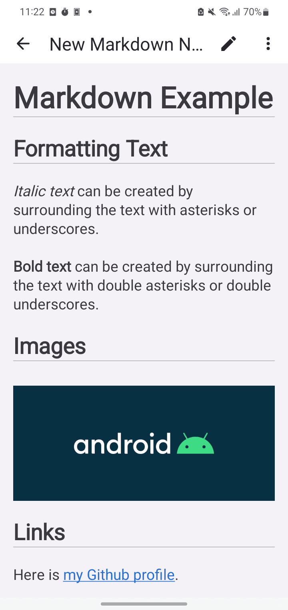
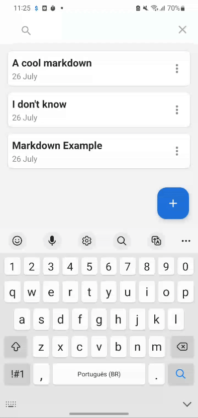
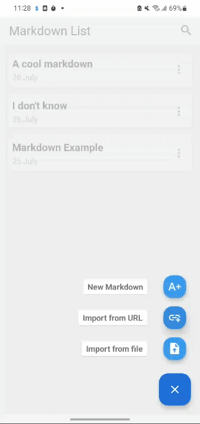
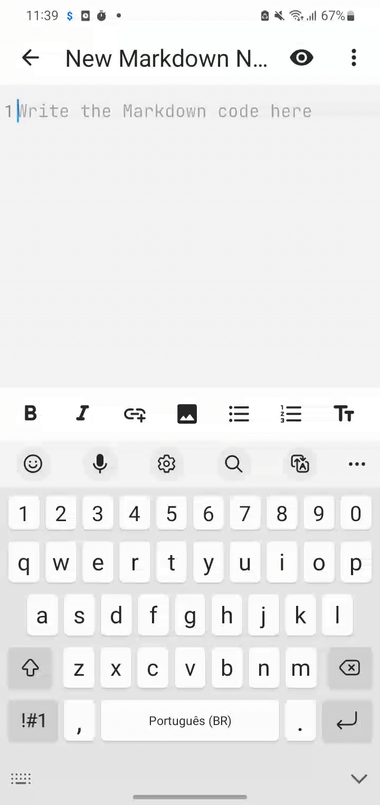

# Markdown Editor
<a href="https://github.com/luizlealdev/markdown-editor/blob/master/LICENSE"></a>
<a href="https://android-arsenal.com/api?level=24"></a>
<a href="https://github.com/luizlealdev"></a>

Markdown Editor demonstrates a simple editor that converts your markdown code and visualize it.

## 📥 Download

<a href="https://github.com/luizlealdev/markdown-editor/releases/latest"></a>

## 📷 Previews
<div align="center">
  
  
  
</div>

## 🛠 Tech Stack & Open Source Libraries
- Minimum SDK level 24.
- [Kotlin language](https://kotlinlang.org/)
- Jetpack
    - ViewBinding: Connect the components from the XML in Kotlin through a class that ensures type safety and other advantages.
    - Lifecycle: Observe Android lifecycles and handle user interface states after lifecycle changes.
    - Room Database: Database abstraction library for SQLite that ensures compile-time safety and ease of use.
    - ViewModel: Manages the holder of data related to the user interface and the lifecycle. Allows data to survive configuration changes, such as screen rotations.
- Architecture
    - MVVM (View - ViewModel - Model)
    - Communication between ViewModel and View through LiveData
    - Communication between ViewModel and Model through Kotlin Flow
    - Repositories for abstraction of communication with the data layer.
- Libraries
    - [OkHttp3](https://github.com/square/retrofit): For making requests following the HTTP standard.
    - [Markwon](https://github.com/noties/Markwon): For process the markdown code.
    - [Fab SpeedDial](https://github.com/leinardi/FloatingActionButtonSpeedDial): For add a Floating Action Button Speed Dial implementation.
    - [CodeView](https://github.com/amrdeveloper/codeview): For add add syntax highlight and line numbers into a EditText.

## 📐 Architecture
**Markdown Editor** follows the [Google's official architecture](https://developer.android.com/topic/architecture).


## ✨ Features

### Search markdown note


### Import markdown from file


### Import markdown from URL


### Markdown tips bar


## 📄 License
```
Copyright 2024 Luiz Leal

Licensed under the Apache License, Version 2.0 (the "License");
you may not use this file except in compliance with the License.
You may obtain a copy of the License at

   http://www.apache.org/licenses/LICENSE-2.0

Unless required by applicable law or agreed to in writing, software
distributed under the License is distributed on an "AS IS" BASIS,
WITHOUT WARRANTIES OR CONDITIONS OF ANY KIND, either express or implied.
See the License for the specific language governing permissions and
limitations under the License.
```